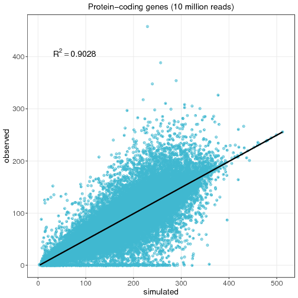
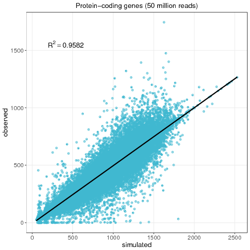
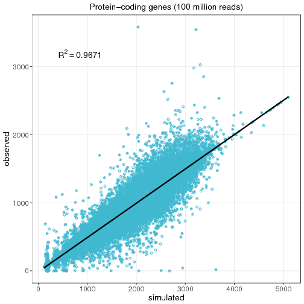
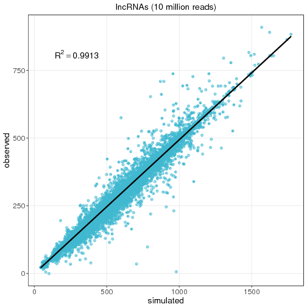
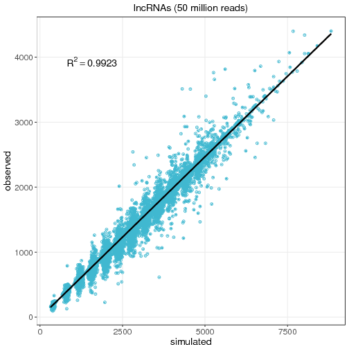
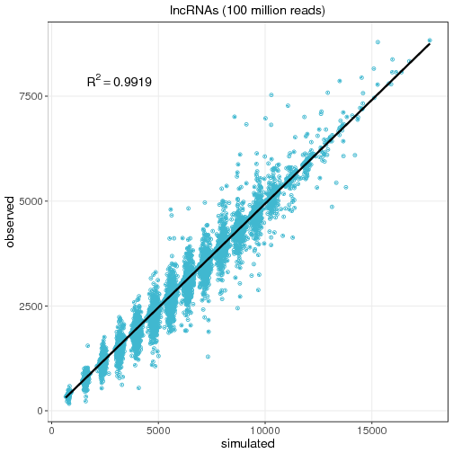

### Case study examples ###

**Let's see *Sandy* in action!!**

#### 1. Simulate genome sequencing. ####

First, a little question: is there a best aligner for my data?

To answare this, we've made some simulations to compare the main aligners in
use today. It was used *Sandy's* default parameters on *Homo sapiens'* GRCh38
genome, and the aligners were **BWA** mem/align and **Bowtie2**. The table
below show the results:

Aligner      | Alignment | Alignment   | Not     | Sensitivity
             | (correct) | (incorrect) | aligned | .
-------------|:---------:|:-----------:|:-------:|------------
**BWA** align| 92.24%    | 3.87%       | 4.87%   | 94.92%
**BWA** mem	 | 91.22%    | 3.89%       | 4.87%   | 94.93%
**Bowtie2**  | 91.24%    | 3.87%       | 4.88%   | 94.92%

#### 2. Simulate a gene expression. ####

A second question: how many reads should I sequence?

Here we simulate gene expression on *Homo sapiens* v26 from GenCode with
**Kallisto**, using a specific expression matrix for *testis* tissue from the
GTeX project. Simulations were made with three diferent number of reads:
10e6 (a), 50e6 (b) and 100e6 (c). See the results bellow:

-----------------------------|------------------------------|-------------------------------
 |  | 

To quantify gene expression of coding genes\*, sequencing of >50M reads is the best choice!

\* Expression per transcript.

Another similar simulation experiment was made for *lnc*RNAs:

------------------------------|-------------------------------|--------------------------------
 |  | 

To quantify gene expression of lncRNAs, sequencing of 10M reads works very well!

#### 3. Conclusion ####

*Sandy* is a straightforward, easy to use, fast, and complete tool to generate
simulated next-generation sequencing reads. Users can easily set information
for their simulations, such as the sequencing coverage, the number of reads,
the read length, the sequencing type, and sequencing error rate, as well as
gene expression and replicated (for simulating transcriptome). We believed
that *Sandy* will be of great value for everybody that need to develop or
choose pipelines for processing NGS data.

[Back to Contents](README.md#contents-at-a-glance)
