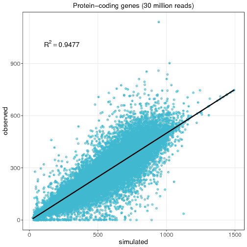

### A case study example ###

**Let's see *Sandy* in action!!**

1. Simulate genome sequencing.

Firt, a little question: is there a best aligner for my data?

To answare this, we've made some simulations to compare the main aligners in
use today. It was used *Sandy's* default parameters on genome GRCh38 for
*Homo sapiens*, and the aligners were BWA mem/align and Bowtie2. The table
below show the results

Aligner      | Alignment | Alignment   | Not     | Sensitivity
             | (correct) | (incorrect) | aligned | .
-------------|:---------:|:-----------:|:-------:|------------
**BWA** align| 92.24%    | 3.87%       | 4.87%   | 94.92%
**BWA** mem	 | 91.22%    | 3.89%       | 4.87%   | 94.93%
**Bowtie2**  | 91.24%    | 3.87%       | 4.88%   | 94.92%

2. Simulate a gene expression.

	 

[Back to Contents](README.md#contents-at-a-glance)
